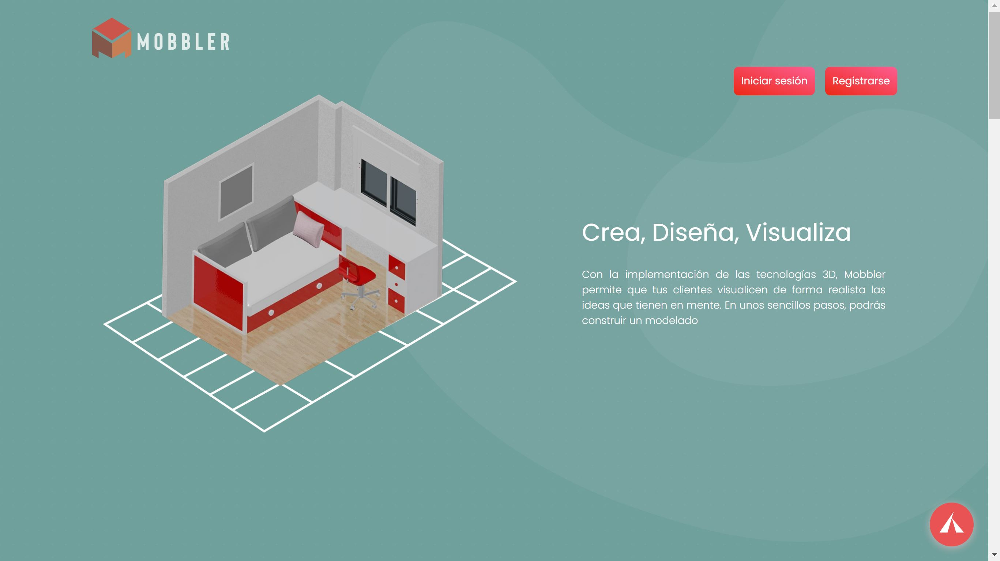
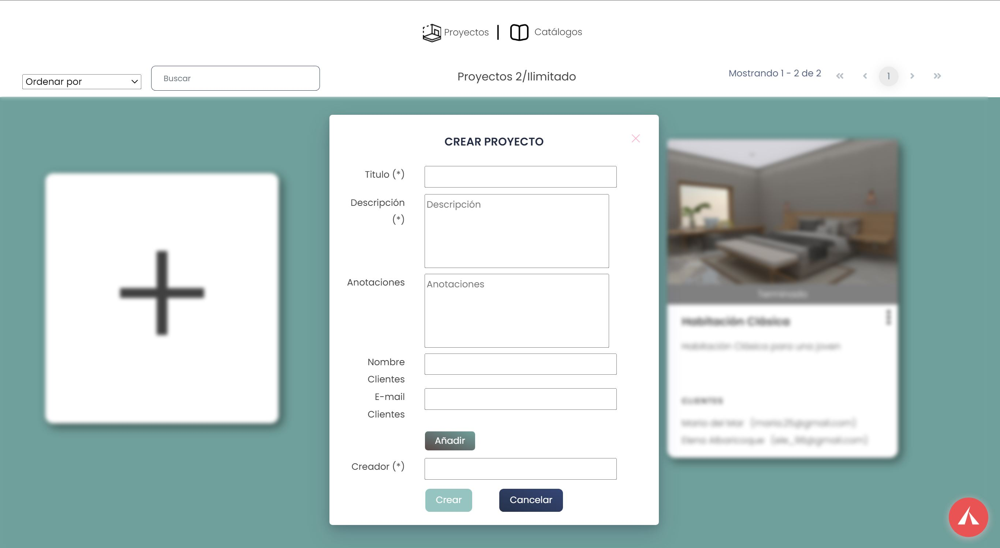

# Mobbler
[ABPGC21] Proyecto de Gestión de Contenidos del grupo Coral Team del ABP 2021/22

URL: https://mobbler.ovh

Imágenes del proyecto

 
Este sería el inicio de la página

 
Contamos con un chatbot creado con RASA

 
Al iniciar sesión nos lleva al gestor de proyectos/catalogos

 
Una vez seleccionado o creado un proyecto, veremos la escena vacía o con muebles

 
Se podrán aplicar múltiples filtros

En la sección de presupuestos podrás ver el coste de los muebles y descargarte un pdf

 
Esto es una ayuda para navegar por la escena

 
También disponemos de un dashboard creado con PowerBi

Y la gestión de los datos

